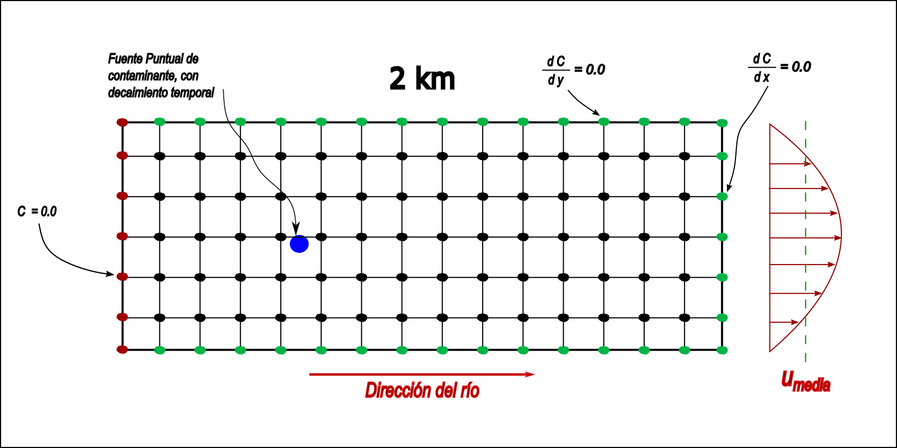
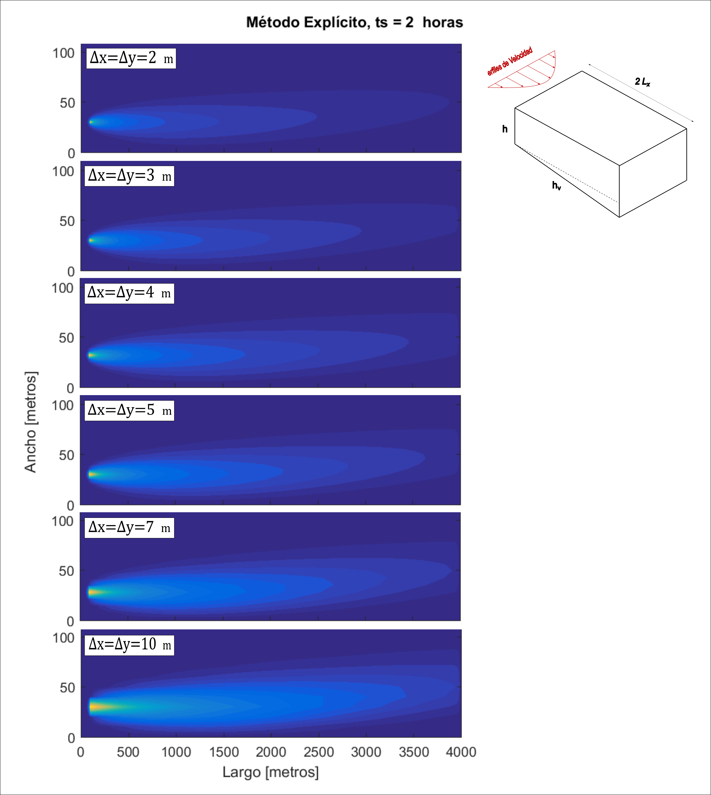

# Convection-Diffusion-FDM
Modelo Bidimensional titulado "Modelo parabólico para pluma de contaminación de un río", resuelto por el método de diferencias finitas en Matlab. 
Se realiza una simulación por el método de diferencias finitas de un tramo de un río, donde pueden observarse las condiciones de borde y el perfil de velocidad empleado. (En el informe adjunto se realiza un detalle de todas las condiciones de velocidad, de borde y distintas discretizaciones empleadas)

siendo las soluciones comparadas para todas las discretizaciones empleadas, desde distintas gráficas para ayudar a entender el fenómeno.

VISTA SUPERIOR DEL RÍO

VISTA CORTE LONGITUDINAL DEL RÍO (a la altura del contaminante)

